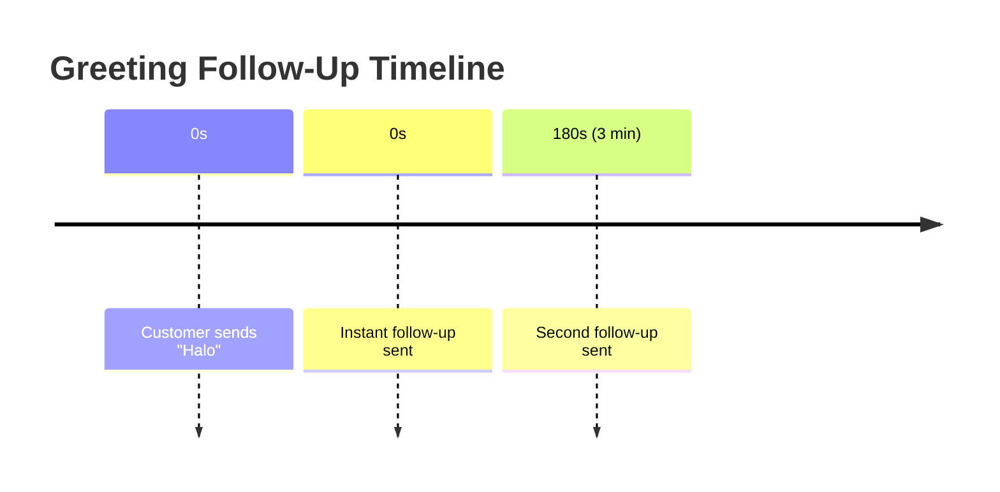
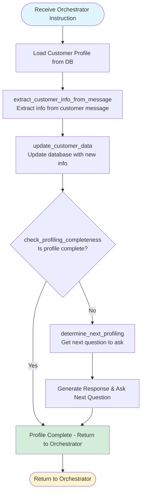
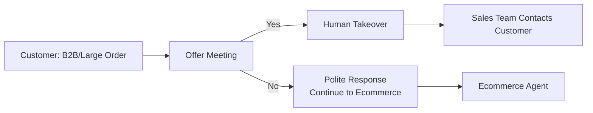
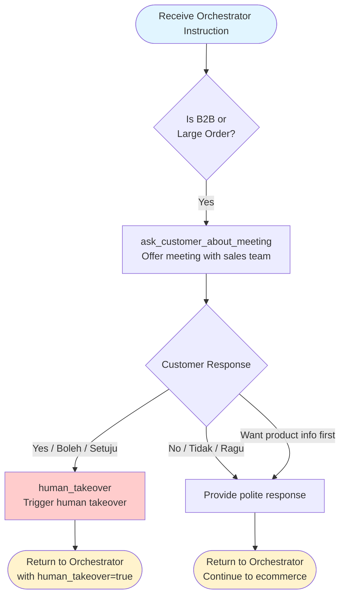
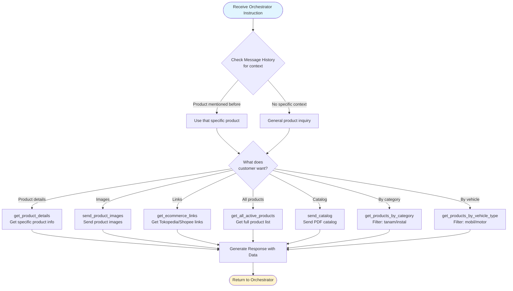
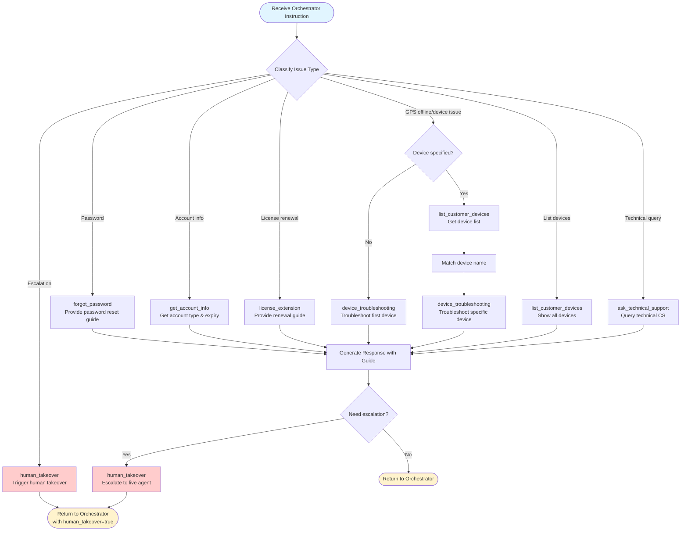
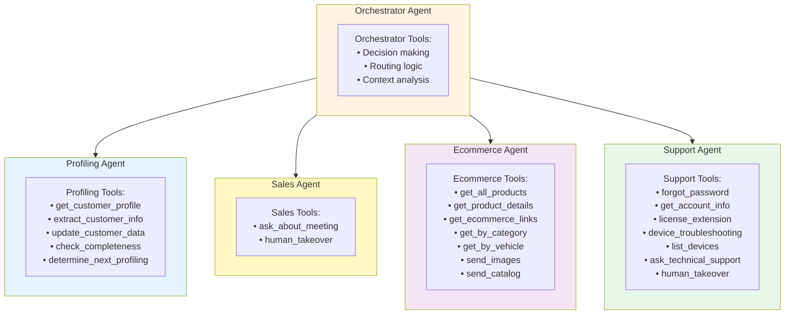
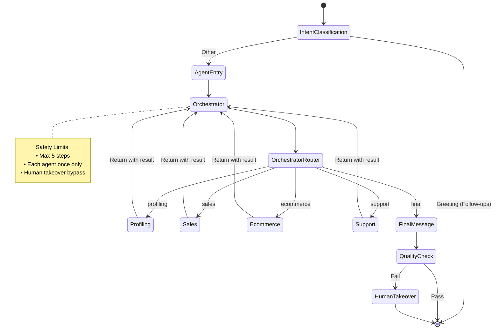

# Hana AI Agent - Architecture Documentation

## Overview

Hana (SiOrin) is an AI customer service agent for ORIN GPS Tracker. It uses an **Orchestrator-Worker architecture** (also known as Supervisor pattern) that enables intelligent multi-agent collaboration with dynamic routing based on customer context and conversation intent.

---

## High-Level Architecture

```mermaid
graph TB
    Start([Customer Message]) --> IC{Intent Classification}

    IC -->|Greeting| FU[Schedule Follow-Ups<br/>• Instant: "Halo kak, ada yang bisa dibantu?"<br/>• After 3min: "Baik Kak, silahkan chat lagi..."]
    FU --> End1([END - No Response])

    IC -->|Other| AE[Agent Entry Handler<br/>Ensure customer_id exists]
    AE --> ORCH[Orchestrator<br/>Traffic Controller]

    ORCH --> PROF[Profiling Agent]
    ORCH --> SALES[Sales Agent]
    ORCH --> ECOM[Ecommerce Agent]
    ORCH --> SUPP[Support Agent]
    ORCH --> FINAL[Final Message]

    PROF --> ORCH
    SALES --> ORCH
    ECOM --> ORCH
    SUPP --> ORCH

    FINAL --> QC{Quality Check}
    QC -->|Pass| End2([END - Send to User])
    QC -->|Fail| HT[Human Takeover]
    HT --> End3([END - Human Agent])

    style IC fill:#e1f5ff
    style ORCH fill:#fff4e1
    style QC fill:#ffe1e1
    style HT fill:#ffcccc
```

---

## Component Details

### 1. Intent Classification Node

**Purpose:** Classify incoming user messages to determine if they require immediate agent attention.

**Location:** `src/orin_ai_crm/core/agents/nodes/intent_classification.py`

**Classification Categories:**
- **"greeting"** - Simple greetings like "Hi", "Hello", "Halo", "Pagi"
- **"other"** - Messages with actual content/information

**Behavior:**

| Classification | Action |
|---------------|--------|
| `greeting` | - Schedule 2 follow-up messages<br/>- Send instantly: "Halo kak, ada yang bisa SiOrin bantu? 😊"<br/>- Send after 3 minutes: "Baik Kak, silahkan chat lagi bila masih butuh bantuan..."<br/>- END workflow (no immediate response) |
| `other` | - Cancel any pending follow-ups<br/>- Continue to agent_entry_handler |

**Follow-Up Timeline:**


---

### 2. Agent Entry Handler

**Purpose:** Ensure customer_id exists and initialize orchestrator state.

**Responsibilities:**
- Get or create customer from database
- Build customer_data from database
- Initialize orchestrator tracking fields:
  - `orchestrator_step` (current step count)
  - `max_orchestrator_steps` (safety limit: 5)
  - `agents_called` (track which agents were called)
  - `orchestrator_instruction` (instruction to next agent)
  - `orchestrator_decision` (routing decision)
  - `human_takeover` (flag for human intervention)

---

### 3. Orchestrator Node (Traffic Controller)

**Purpose:** Decide which worker agent to call next based on customer context and conversation state.

**LLM Model:** Advanced (for complex routing decisions)

**Decision Schema:**
```python
class OrchestratorDecision(BaseModel):
    next_agent: Literal["profiling", "sales", "ecommerce", "support", "final"]
    reasoning: str  # Explanation of the decision
    instruction: str  # Instruction to the next agent (first-person POV)
```

**Routing Logic:**

| Customer Intent | Routes To |
|----------------|-----------|
| Customer data/form/update | `profiling` |
| Product questions (price, catalog, features) | `ecommerce` |
| Meeting request, B2B inquiry | `sales` |
| Password issues, license, GPS offline, technical support | `support` |
| All questions answered | `final` |

**Business Rules:**
- **Profiling Priority:** Usually call profiling_agent first
- **Sales vs Ecommerce:**
  - `is_b2b=True` OR `unit_qty>5` → prefer `sales_agent`
  - `is_b2b=False` AND `unit_qty≤5` → prefer `ecommerce_agent`
- **Multi-Intent:** Can call multiple agents in sequence
- **Once-Only Rule:** Each agent can only be called once per chat request

---

### 4. Worker Agents

#### A. Profiling Agent

**Purpose:** Collect and update customer data.

**LLM Model:** Advanced (for structured data extraction)

**Tools:**
- `update_customer_data` - Update specific customer fields
- `extract_customer_info_from_message` - Extract info using LLM
- `check_profiling_completeness` - Check if profiling is complete
- `determine_next_profiling` - Determine what to ask next

**Customer Data Fields:**
- `name` - Customer name
- `domicile` - Customer location
- `vehicle_id` - Vehicle type ID
- `vehicle_alias` - Vehicle name
- `unit_qty` - Number of units
- `is_b2b` - B2B customer flag
- `is_onboarded` - Onboarding complete flag

**Internal Flow:**


**Tool Functions:**

| Tool | Purpose | Returns |
|------|---------|---------|
| `get_customer_profile` | Load fresh customer data from DB | Customer data dict |
| `extract_customer_info_from_message` | Use LLM to extract structured info | Extracted fields |
| `update_customer_data` | Update specific customer field in DB | Success confirmation |
| `check_profiling_completeness` | Check which fields are still missing | Completeness status |
| `determine_next_profiling` | Get next question based on missing fields | Next question text |

---

#### B. Sales Agent

**Purpose:** Handle B2B and large order sales flow.

**LLM Model:** Medium (simple qualification flow)

**Tools:**
- `ask_customer_about_meeting` - Offer meeting with sales team
- `human_takeover` - Trigger human takeover when customer agrees

**Conversation Flow:**


**Internal Flow:**


**Tool Functions:**

| Tool | Purpose | Behavior |
|------|---------|----------|
| `ask_customer_about_meeting` | Offer meeting to B2B customer | Generates meeting offer message |
| `human_takeover` | Trigger human agent intervention | Sets `human_takeover=true` flag |

**Decision Triggers:**

| Customer Says | Action |
|---------------|--------|
| "Ya", "Boleh", "Setuju", "Oke", "Siap" | Trigger `human_takeover` |
| "Tidak", "Nggak", "Gak mau", "Lain kali saja" | Polite response, continue |
| "Info produk dulu", "Harganya berapa?" | Polite response, route to ecommerce |

---

#### C. Ecommerce Agent

**Purpose:** Handle product inquiries, pricing, and catalog for B2C/small orders.

**LLM Model:** Advanced (heavy tool calling, prevents hallucination)

**Tools:**
- `get_all_active_products` - Get all active products
- `get_product_details` - Get specific product details
- `get_ecommerce_links` - Get e-commerce links (Tokopedia, Shopee)
- `get_products_by_category` - Filter by category (tanam/instal)
- `get_products_by_vehicle_type` - Filter by vehicle type (mobil/motor)
- `send_product_images` - Send product images via WhatsApp
- `send_catalog` - Send catalog PDF

**Special React Prompt:**
The ecommerce agent has a custom react prompt that:
- Checks conversation history for contextual references ("produknya" = the product mentioned earlier)
- Only calls tools for RELEVANT products (not all 9 products)
- Understands contextual requests like "foto produknya" refers to the LAST product discussed

**Internal Flow:**


**Tool Functions:**

| Tool | Purpose | Parameters | Returns |
|------|---------|------------|---------|
| `get_all_active_products` | Get all active products | None | List of 9 products with details |
| `get_product_details` | Get specific product details | `product_id` | Detailed product information |
| `get_ecommerce_links` | Get e-commerce links | `product_ids` | Tokopedia & Shopee links |
| `get_products_by_category` | Filter by installation type | `category` (tanam/instal) | Filtered product list |
| `get_products_by_vehicle_type` | Filter by vehicle type | `vehicle_type` (mobil/motor) | Filtered product list |
| `send_product_images` | Send product images via WhatsApp | `sort_orders` | Sets `send_images=true` |
| `send_catalog` | Send catalog PDF | None | Sets `send_pdfs=true` |

**Context-Aware Examples:**

| Customer Message | Context | Action |
|-----------------|---------|--------|
| "Produknya ada foto?" | Last discussed: OBU V | Call `send_product_images` for OBU V only |
| "Link tokpednya dong" | Last discussed: AI CAM | Call `get_ecommerce_links` for AI CAM only |
| "Minta semua produk" | No specific context | Call `get_all_active_products` |
| "Untuk motor apa?" | No specific context | Call `get_products_by_vehicle_type(motor)` |

---

#### D. Support Agent

**Purpose:** Handle complaints, technical support, and account issues.

**LLM Model:** Medium (FAQ-style responses)

**Tools:**
- `forgot_password` - Password reset guide
- `get_account_info` - Get account type and expiry
- `license_extension` - License renewal guide
- `device_troubleshooting` - GPS offline/not updating issues
- `list_customer_devices` - List all customer devices
- `ask_technical_support` - Advanced technical queries
- `human_takeover` - Escalate to live agent

**When to Use `ask_technical_support`:**
- Operating hours (jam kerja, idle/moving duration)
- Vehicle utilization
- Distance traveled (KM estimation)
- Driving behavior (overspeed, braking, cornering)
- Speed analysis
- Fuel estimation
- Static GPS data (location, speed at specific time)
- Alerts/notifications (speeding, geofence, device on/off)
- Account issues (password, status, expired)

**Human Takeover Triggers:**
- Customer sends username & email after password guide
- Technical issues beyond standard guides
- Customer explicitly requests human CS
- Recurring issues despite solutions

**Internal Flow:**


**Tool Functions:**

| Tool | Purpose | Returns |
|------|---------|---------|
| `forgot_password` | Provide password reset instructions | Step-by-step password reset guide |
| `get_account_info` | Get customer account details | Account type, expiry date, status |
| `license_extension` | Provide license renewal guide | Renewal steps based on account type |
| `device_troubleshooting` | Troubleshoot GPS device issues | Troubleshooting steps for device |
| `list_customer_devices` | List all customer devices | Array of device_name, device_type |
| `ask_technical_support` | Query technical CS for advanced data | Technical data from VPS |
| `human_takeover` | Escalate to live agent | Sets `human_takeover=true` flag |

**Issue Classification:**

| Customer Message | Issue Type | Tool(s) to Use |
|-----------------|------------|----------------|
| "Lupa password" | Password | `forgot_password` |
| "Akun saya apa?" | Account Info | `get_account_info` |
| "Perpanjangan lisensi" | License | `license_extension` |
| "GPS offline" / "Tidak update" | Device Issue | `list_customer_devices` → `device_troubleshooting` |
| "Jam kerja kendaraan?" | Technical Query | `ask_technical_support` |
| "Berapa KM bulan ini?" | Technical Query | `ask_technical_support` |
| "Speeding alert" | Technical Query | `ask_technical_support` |
| "Bisa bicara CS?" | Escalation | `human_takeover` |

**`ask_technical_support` Query Types:**

| Category | Queries |
|----------|---------|
| **Operating Hours** | Jam kerja, durasi idle/moving |
| **Utilization** | Hari tidak beroperasi, frekuensi penggunaan |
| **Distance** | Estimasi KM tempuh |
| **Driving Behavior** | Overspeed, braking, cornering incidents |
| **Speed Analysis** | Kecepatan rata-rata/max |
| **Fuel** | Estimasi konsumsi BBM |
| **Static Data** | Lokasi, kecepatan pada waktu tertentu |
| **Alerts** | Speeding, geofence, device on/off notifications |
| **Account** | Password, status, expired |

---

### Agent Tools Overview



**Tools Count Summary:**

| Agent | Number of Tools | Complexity |
|-------|-----------------|------------|
| Orchestrator | 0 (decision-making only) | High |
| Profiling | 5 | Medium |
| Sales | 2 | Low |
| Ecommerce | 7 | High |
| Support | 7 | High |

---

### 5. Quality Check Node

**Purpose:** Evaluate the quality of AI-generated responses before sending to user.

**LLM Model:** Basic (simple validation)

**Evaluation Criteria:**
- Response accuracy
- Completeness
- Tone and language
- Formatting

**Routing:**
- `pass` → END (send to user)
- `fail` → human_takeover

---

### 6. Final Message Node

**Purpose:** Prepare the final response with optional form attachment.

**LLM Model:** Basic (template-based)

**Responsibilities:**
- Generate WhatsApp message bubbles
- Attach form if `send_form=true`
- Format response for WhatsApp API

---

### 7. Human Takeover Node

**Purpose:** Trigger human agent intervention when AI cannot handle the request.

**Triggers:**
- Quality check failure
- Customer explicitly requests human
- Sales meeting confirmed
- Complex technical issues
- Recurring problems

**Behavior:**
- Bypass quality check
- Notify human agents
- Transfer conversation context

---

## Orchestrator Loop Flow



---

## Safety Mechanisms

### 1. Step Limit
- **Max Steps:** 5 orchestrator loops
- **Purpose:** Prevent infinite loops
- **Behavior:** Forces "final" decision when limit reached

### 2. Agent Hard-Cap
- **Rule:** Each agent can only be called once per chat request
- **Purpose:** Prevent redundant calls and loops
- **Behavior:** Forces "final" if orchestrator tries to call an already-called agent

### 3. Human Takeover Flag
- **Priority:** Highest priority routing
- **Behavior:** Bypasses quality check, goes directly to human_takeover node
- **Set by:** Any agent tool can set this flag

---

## LLM Model Tiers

| Agent | Model | Rationale |
|-------|-------|-----------|
| Orchestrator | Advanced | Complex routing decisions, full context analysis |
| Ecommerce | Advanced | Heavy tool calling, prevents hallucination |
| Profiling | Advanced | Structured data extraction |
| Sales | Medium | Simple qualification flow |
| Support | Medium | FAQ-style responses |
| Final Message | Basic | Template-based responses |
| Quality Check | Basic | Simple validation |

---

## State Management

The agent maintains state across the conversation:

```python
AgentState {
    # Customer Information
    customer_id: int
    customer_data: {
        name: str
        domicile: str
        vehicle_id: int
        vehicle_alias: str
        unit_qty: int
        is_b2b: bool
        is_onboarded: bool
    }

    # Conversation
    messages: List[Message]
    messages_history: List[Message]

    # Orchestrator State
    orchestrator_step: int
    max_orchestrator_steps: int
    agents_called: List[str]
    orchestrator_decision: Dict
    orchestrator_instruction: str

    # Flags
    send_form: bool
    human_takeover: bool
    session_ending_detected: bool
}
```

---

## Example Conversations

### Example 1: Simple Greeting

```
Customer: "Halo"
↓
Intent Classification: greeting
↓
Schedule Follow-Ups
• Instant: "Halo kak, ada yang bisa SiOrin bantu? 😊"
• After 3min: "Baik Kak, silahkan chat lagi..."
↓
END (no immediate response)
```

### Example 2: Product Inquiry

```
Customer: "Halo, saya mau tanya produk ORIN"
↓
Intent Classification: other
↓
Agent Entry → Orchestrator
↓
Orchestrator Decision: "ecommerce"
Instruction: "Customer wants to know about ORIN products"
↓
Ecommerce Agent
• Calls: get_all_active_products
• Response: Product list with details
↓
Orchestrator Decision: "final"
↓
Final Message → Quality Check → END
```

### Example 3: B2B Sales Flow

```
Customer: "Saya dari perusahaan, butuh 10 unit GPS"
↓
Intent Classification: other
↓
Orchestrator Decision: "profiling"
↓
Profiling Agent updates customer data (is_b2b=True, unit_qty=10)
↓
Orchestrator Decision: "sales"
↓
Sales Agent offers meeting
↓
Customer: "Boleh, meeting kapan?"
↓
Sales Agent: human_takeover
↓
Human Takeover → Sales team contacts customer
```

---

## File Structure

```
src/orin_ai_crm/core/agents/
├── custom/
│   └── hana_agent/
│       ├── __init__.py              # Main exports
│       ├── agent_graph.py           # Orchestrator-Worker graph
│       ├── custom_agent.py          # Custom ReAct agent implementation
│       ├── default_prompts.py       # Default agent prompts
│       └── default_products.py      # Default product data
├── nodes/
│   ├── intent_classification.py     # Intent classification node
│   ├── quality_check_nodes.py       # Quality check & final message
│   └── ...
└── tools/
    ├── agent_tools.py               # Orchestrator tools
    ├── customer_agent_tools.py      # Profiling tools
    ├── sales_agent_tools.py         # Sales tools
    ├── ecommerce_agent_tools.py     # Ecommerce tools
    └── support_agent_tools.py       # Support tools
```

---

## Key Features

1. **Intent-Based Routing:** Classifies messages to handle greetings differently
2. **Follow-Up Automation:** Automated follow-up messages for greeting-only interactions
3. **Multi-Agent Orchestration:** Dynamic agent routing based on context
4. **Context Awareness:** Maintains full conversation history for contextual understanding
5. **Safety Mechanisms:** Step limits, agent hard-caps, human takeover
6. **Modular Design:** Easy to add new agents or modify existing ones
7. **Database-Driven:** Prompts loaded from database for easy updates
8. **Provider Support:** Works with both OpenAI and Gemini (with provider-specific optimizations)

---

## Performance Optimizations

1. **Tiered LLM Usage:** Different agents use appropriate model tiers
2. **Tool Result Caching:** Avoids redundant database calls
3. **Message Filtering:** Provider-aware message filtering for efficiency
4. **Timeout Protection:** 30-second timeouts prevent hanging
5. **State Update Tracking:** Tools can update state directly to avoid re-fetches

---

## Monitoring & Logging

All nodes log:
- Entry/Exit with node name
- Decision reasoning
- Tool calls and results
- State changes
- Errors and exceptions

Example log format:
```
ENTER: orchestrator_node
Orchestrator decision: ecommerce
Reasoning: Customer is asking about product prices
Instruction: Customer wants to know pricing for GPS products
EXIT: orchestrator_node
```

---

## Future Enhancements

Potential improvements:
1. **Analytics Dashboard:** Track agent usage and routing patterns
2. **A/B Testing:** Test different prompt versions
3. **Sentiment Analysis:** Detect customer sentiment for routing
4. **Multi-Language Support:** Add language detection and translation
5. **Integration Extensions:** Add more channels (Telegram, Line, etc.)

---

## Conclusion

The Hana AI Agent architecture provides a robust, scalable, and maintainable solution for AI-powered customer service. The Orchestrator-Worker pattern enables intelligent routing and multi-agent collaboration while maintaining safety and performance.

For questions or contributions, please refer to the project repository.
